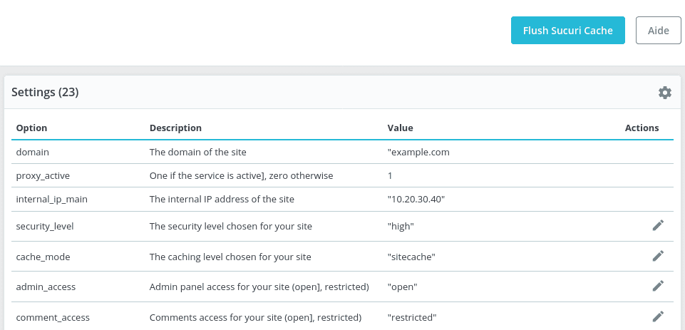

# Prestashop Sucuri

[](https://php.net/)
[](https://www.prestashop.com)
[](https://github.com/Pixel-Open/prestashop-sucuri/releases)

## Presentation

Manage your Sucuri WAF in Prestashop.



## Requirements

- Prestashop >= 1.7.6.0
- PHP >= 7.2.0

## Installation

Download the **pixel_sucuri.zip** file from the [last release](https://github.com/Pixel-Open/prestashop-sucuri/releases/latest) assets.

### Admin

Go to the admin module catalog section and click **Upload a module**. Select the downloaded zip file.

### Manually

Move the downloaded file in the Prestashop **modules** directory and unzip the archive. Go to the admin module catalog section and search for "Sucuri".

## Configuration

From the module manager, find the module and click on configure.

| Field              | Description           | Required |
|:-------------------|:----------------------|----------|
| Sucuri API Key     | The Sucuri API key    | Y        |
| Sucuri API Secret  | The Sucuri API Secret | Y        |

## Settings

Sucuri settings are available under the menu: *Advanced settings > Sucuri Settings*

**Action:**

- **Flush Sucuri Cache:** Allows to flush the Sucuri cache

**List:**

- **Refresh**: Refresh the Sucuri config values saved in the local cache
- **Update**: Update a Sucuri config value

## Logs

Display Audit Trails under the menu: *Advanced settings > Sucuri Logs*

**Action:**

- **Refresh:** Add the logs for the current day

### CLI

```shell
./bin/console sucuri:log-refresh
```

It's recommended to refresh the logs hourly using a CRON job.

```php
0 * * * * /path/to/prestashop/bin/console sucuri:log-refresh
```